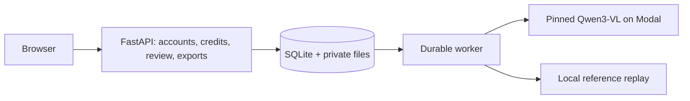

# Unrender

Turn chart images into editable data, with the source and review history attached.

[Live app](https://unrender.onrender.com/) · [Demo](https://screen.studio/share/4lFdVojh) · [Engineering review](docs/ENGINEERING_REVIEW.md) · [Documentation](docs/README.md) · [CI](https://github.com/ryouol/Unrender/actions/workflows/ci.yml)

Upload a chart, compare the extracted table with its source, correct it, approve it, and export CSV, JSON, or an Excel workbook with an Audit sheet. Unrender combines a FastAPI web app with a post-trained Qwen3-VL-4B model on Modal.

**Status: controlled beta.** The September 18 release passed a hosted extraction/review/export check and a restore drill. Representative model accuracy, serving capacity and actual inference cost remain unmeasured. See [readiness](docs/LAUNCH_READINESS.md) for the open gates.


*Local application capture with illustrative fixture data. [More screenshots and capture details](docs/screenshots/README.md).*

## Try it

The [live app](https://unrender.onrender.com/) supports Google or password signup with three testing credits. One dispatched extraction consumes one credit, including failed or cancelled inference; attempts stopped before dispatch are refunded. Email delivery and billing are off.

Upload PNG, JPEG, WebP, or PDF: up to 10 MiB, 4 MP per image, or 25 PDF pages. Select one chart with readable labels. Charts are retained for 30 days. [Account and credit policy](docs/PUBLIC_ACCOUNTS.md).

## Run locally

Use Python 3.11 and Git. Node.js is needed for browser regression tests. Local replay needs no GPU or cloud credentials and accepts only the bundled reference chart.

```bash
git clone https://github.com/ryouol/Unrender.git
cd Unrender
python3.11 -m venv .venv
source .venv/bin/activate
python -m pip install --require-hashes -r requirements-dev.lock
python -m pip install --require-hashes -r requirements-build.lock
python -m pip install --no-deps --no-build-isolation -e .
sh scripts/run_local.sh
```

Open [localhost:8000](http://127.0.0.1:8000/), choose **Sign in → Open reference example**, edit a value, save and approve, then download the workbook. Sign-out removes the sample workspace. The launcher disables external services and stores data in ignored `outputs/local-runtime/`; no `.env` copy is needed.

Alternatively, `docker compose up --build` runs the local app with a persistent named volume. Real extraction requires the [Render + Modal configuration](docs/RENDER_MODAL_LAUNCH.md); model weights are private and not included in a clone.

## Architecture



One Render container serves the frontend, API and worker. SQLite and source files share one persistent disk; GPU inference runs separately on Modal. Production worker concurrency is one. This deployment supports one application replica per SQLite volume.

Corrections create immutable result versions. Approval applies to the exact reviewed version, and exports include source, extraction and review provenance. Tenant-scoped idempotency keys prevent duplicate API submissions from creating another job or charge within the replay window. [Architecture](docs/ARCHITECTURE.md) · [API contract](docs/API.md).

| Code | Purpose |
|---|---|
| [`unrender/product/`](unrender/product/) | API, accounts, storage, worker, review and exports |
| [`unrender/product/static/`](unrender/product/static/) | Frontend; no build step |
| [`unrender/train/`](unrender/train/), [`modal_train.py`](modal_train.py) | Training and GPU execution |
| [`unrender/eval/`](unrender/eval/), [`analysis/`](analysis/) | Evaluation and reproducible diagnostics |
| [`unrender/data_gen/`](unrender/data_gen/), [`unrender/schema/`](unrender/schema/) | Synthetic charts and typed data contracts |
| [`tests/`](tests/), [`release/`](release/) | Regression tests and saved evidence |

## Verify and review

```bash
ruff check unrender/product unrender/schema/chart_schema.py tests
ruff check --select S unrender/product
mypy unrender/product
pytest -q
```

The [CI workflow](.github/workflows/ci.yml) also checks training contracts, dependency locks, packaging and the production container. See [contributing](CONTRIBUTING.md) for setup and [engineering review](docs/ENGINEERING_REVIEW.md) for the reading order, test map and failure cases.

Model evidence has known limits: the Common300 audit found defective truth in 109/300 charts, and the real-chart audit rejected all eight historical annotations. The 72-chart development packet awaits independent review. Historical scores remain available for reproduction, but cannot establish representative accuracy. Start with the [evaluation contract](docs/EVALUATION_CONTRACT.md) and [benchmark plan](docs/AUDIT_REMEDIATION.md).

Code is [Apache-2.0](LICENSE). See [third-party notices](THIRD_PARTY_NOTICES.md) and the separate [model/data legal review](docs/LEGAL_REVIEW.md).
