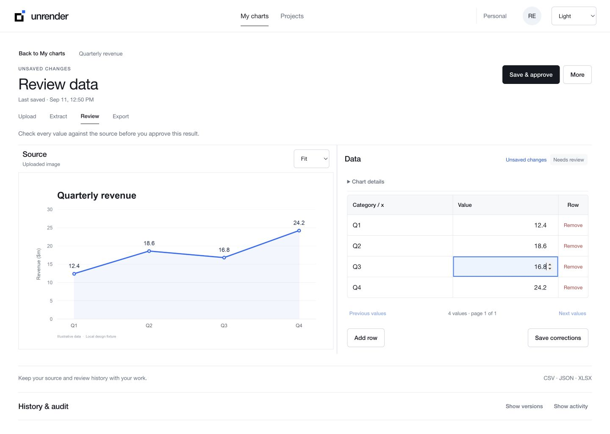
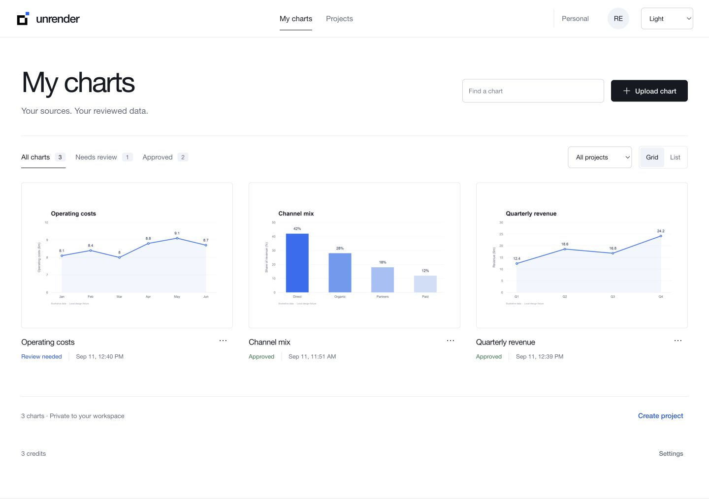
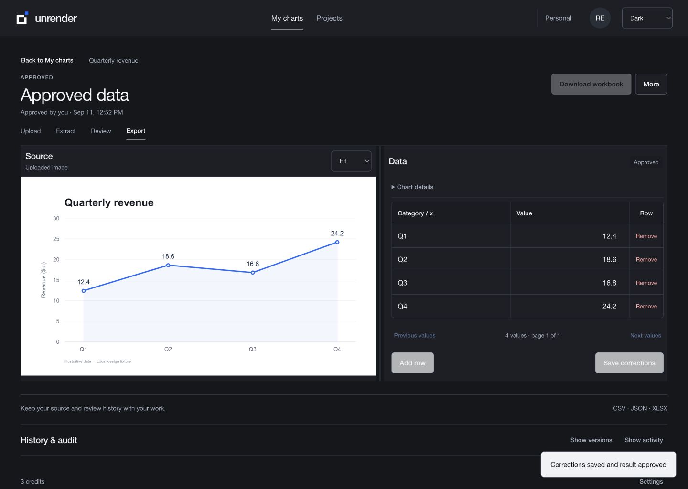
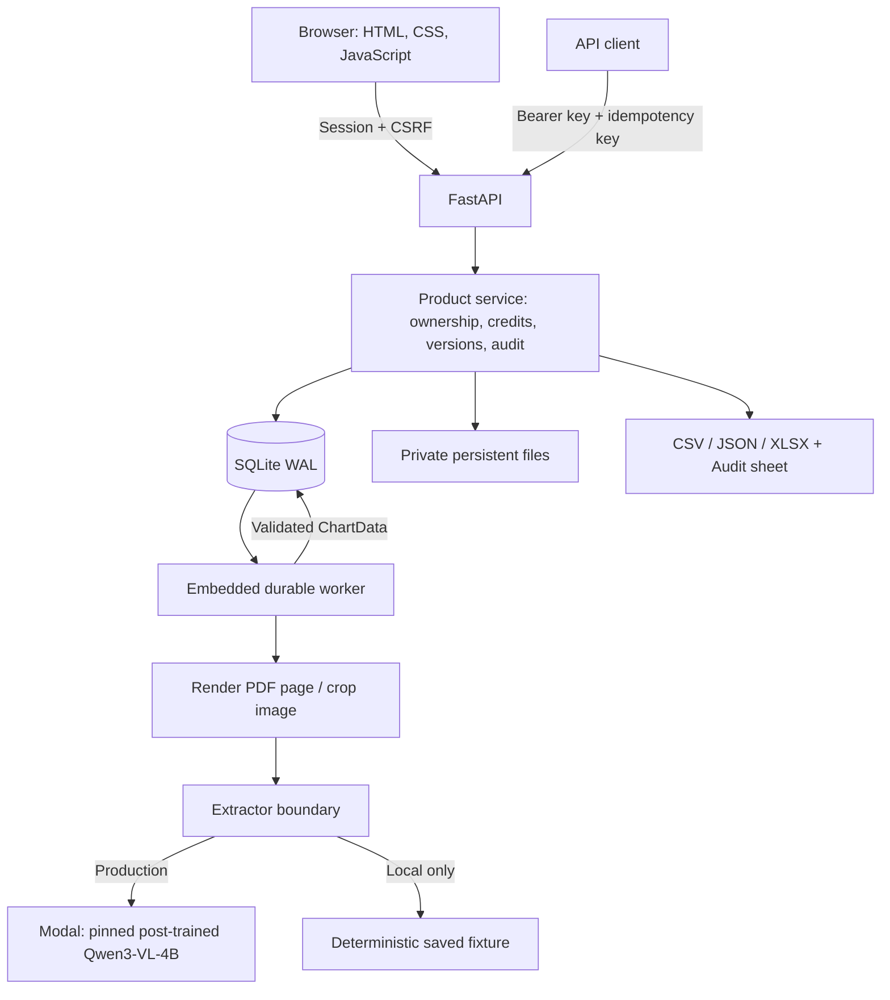

# Unrender

**Turn chart images into editable data, with the source and review history attached.**

[Open the live app](https://unrender.onrender.com/) · [Watch the demo](https://screen.studio/share/4lFdVojh) · [Engineering review guide](docs/ENGINEERING_REVIEW.md) · [CI](https://github.com/ryouol/Unrender/actions/workflows/ci.yml)

Unrender helps analysts recover numbers from charts in reports, presentations, and screenshots when the original spreadsheet is unavailable. Upload a chart, compare the extracted table with its source, correct it, approve it, and export CSV, JSON, or an Excel workbook with an Audit sheet.

This repository contains both the web product and the research pipeline behind its post-trained chart extraction model. The product's promise is **reviewable data**, not guaranteed automatic accuracy.



*Actual local application capture with illustrative fixture data. Screenshots demonstrate the interface; they do not measure model accuracy. [Capture provenance and more views](docs/screenshots/README.md).*

## Try it

| Route | What to expect |
|---|---|
| [Live beta](https://unrender.onrender.com/) | Google or email/password signup; **3 free testing credits per new account**. Uploads call the pinned model on Modal. Email delivery and customer billing are off. |
| [Video walkthrough](https://screen.studio/share/4lFdVojh) | Owner-recorded product demo hosted on Screen Studio. Treat it as a workflow demonstration, not a benchmark or latency measurement. |
| Local replay, below | No cloud credentials or GPU required. Runs only the bundled saved fixture; arbitrary chart inference requires Modal. |

Live input limits: PNG, JPEG, WebP, or PDF; **10 MiB per file**, images up to **4 MP**, PDFs up to **25 pages**. Choose one chart with readable axes and labels. Charts have a 30-day retention window; download exports you want to keep.

One extraction attempt reserves one credit. It is refunded if the attempt ends before provider dispatch. Once dispatched, the attempt consumes the credit even if inference fails or is cancelled. Signing in or connecting Google does not grant another welcome allowance. See [account policy](docs/PUBLIC_ACCOUNTS.md).

<details>
<summary>More product screenshots — landing page, chart library, and dark mode</summary>

### Landing page


### Private chart library



### Approved result in dark mode



These are September 11 local application captures using illustrative data. The landing artwork is a concept illustration; the library and table values are fixtures. They are not customer uploads or live model predictions.

</details>

## Run locally

Prerequisites: **Python 3.11**, Git, and Node.js for browser regression tests. No frontend build step or GPU is needed for replay.

```bash
git clone https://github.com/ryouol/Unrender.git
cd Unrender
python3.11 -m venv .venv
source .venv/bin/activate
python -m pip install --require-hashes -r requirements-dev.lock
python -m pip install --require-hashes -r requirements-build.lock
python -m pip install --no-deps --no-build-isolation -e .
sh scripts/run_local.sh
```

Open [localhost:8000](http://127.0.0.1:8000/), choose **Sign in → Run saved model replay**, and wait for the review table. Change a value, save and approve, then download the workbook and inspect its **Audit** sheet. This is an isolated ephemeral sample workspace; sign-out removes it.

The launcher explicitly disables Google, email, billing, and external inference, and stores local data under ignored `outputs/local-runtime/`. Its replay extractor accepts the bundled fixture only. Local limits differ from production; the UI reads them from `/api/public-config`. Copying `.env.example` is unnecessary for this launcher.

Alternatively, use the development container (port 8000 must be free):

```bash
docker compose up --build
```

Compose keeps data in a named local volume. Both launch methods are for local evaluation; production configuration deliberately rejects replay mode. For real extraction, follow [Render + Modal deployment](docs/RENDER_MODAL_LAUNCH.md) and [operations](docs/OPERATIONS.md). Model weights and cloud credentials are not bundled with a clone.

## How it is built



**Hosting:** one Render container serves the frontend, API, and embedded worker. SQLite and private source files live on one persistent disk. Modal runs GPU inference separately. Google provides sign-in identity; application accounts, sessions, credits, and chart ownership stay in Unrender. There is no Vercel frontend or GCP application backend in this deployment.

**Model:** production uses the project's post-trained Qwen3-VL-4B table LoRA, served through `modal_train.py::infer_one`. The app checks pinned model and provider release identities. Local replay returns deterministic fixture data and never calls that model. [Architecture and trust boundaries](docs/ARCHITECTURE.md) · [Google sign-in](docs/GOOGLE_SIGNIN.md).

**Workflow:** upload → queued → running → review → approved → export. Corrections create immutable result versions; reprocessing preserves the previous result if the new attempt fails. Source files are removed through a durable deletion outbox. XLSX contains the audit metadata; CSV and JSON are data-only exports.

## Engineering evaluation

Start with the [review guide](docs/ENGINEERING_REVIEW.md) for a reading order, test map, failure cases, and evidence boundaries.

```bash
# In the activated virtual environment above:
ruff check unrender/product unrender/schema/chart_schema.py tests
ruff check --select S unrender/product
mypy unrender/product
pytest -q
```

`pytest` also invokes the workflow, Google, previews, and landing Node harnesses. For a focused UI-only rerun, use `node tests/browser_workflow.mjs` or the other harnesses in the [test map](docs/ENGINEERING_REVIEW.md#test-map).

The full release checks, including locked dependency audits, package build, and production container smoke tests, are defined in [CI](.github/workflows/ci.yml). The `a14b961` runtime release passed **320 tests, 1 skipped**, plus the documented browser checks; branch, PR, and main CI passed. This is a dated result, not a guarantee that every environment or future change passes. [Release evidence](docs/RENDER_MODAL_LAUNCH.md).

| Start here | Responsibility |
|---|---|
| [`unrender/product/web.py`](unrender/product/web.py) | HTTP routes, sessions, CSRF, request admission |
| [`unrender/product/service.py`](unrender/product/service.py) | Ownership, credit ledger, chart lifecycle, versions, exports |
| [`unrender/product/database.py`](unrender/product/database.py) | Schema migrations, transactions, operational locking |
| [`unrender/product/storage.py`](unrender/product/storage.py) | Upload validation, private files, publication and deletion |
| [`unrender/product/worker.py`](unrender/product/worker.py) | Leases, provider dispatch, cancellation, restart recovery |
| [`unrender/product/extractors.py`](unrender/product/extractors.py) | Replay and pinned Modal boundaries |
| [`unrender/product/static/`](unrender/product/static/) | Landing page, auth, chart library, review editor |
| [`unrender/schema/`](unrender/schema/) | Typed chart contract |
| [`unrender/train/`](unrender/train/), [`unrender/eval/`](unrender/eval/), [`unrender/data_gen/`](unrender/data_gen/) | Training, scoring, and synthetic data generation |
| [`tests/`](tests/), [`release/`](release/) | Regression tests, frozen evaluation inputs, saved receipts |

For programmatic use, see [API contracts](docs/API.md). Submissions require a tenant-scoped idempotency key; exact retries within the replay window do not create another job or charge another credit.

## Evidence and limitations

**Status: deployed controlled beta.** A running service and passing tests do not establish a broadly validated or enterprise-ready product.

- **Accuracy:** saved `common300` research results report 38.9% `cell@5_exact` for the table LoRA versus 13.5% for its pinned base. A separate three-chart production pilot recovered 15/15 values on crisp synthetic inputs. Neither is a representative customer benchmark. Human correction time remains unmeasured. [Research results](RESULTS.md) · [Claim boundaries](RESULT_TO_CLAIM.md) · [Pilot evidence](docs/LAUNCH_EVALUATION.md).
- **Latency and cost:** the three pilot uploads took approximately 68–193 seconds end to end. Actual dollar cost was not measured. Signup credits are per account, not an abuse-proof per-person allowance or a provider spending cap.
- **Scale:** one application replica per SQLite volume. Multi-node operation requires database, file storage, queue, and rate-limiting changes. There are no shared-team roles or enterprise SSO.
- **Recovery:** email delivery and self-service email recovery are off. Google-only users recover through Google; password-account recovery needs operator verification. Backups have a separate retention policy from live deletion.
- **Remaining release gates:** broader quality evaluation, legal/provenance approval, external accessibility/security validation, and container advisory disposition. The recorded Debian scan contains unresolved findings; see [container scan](docs/CONTAINER_SCAN.md) and the [readiness checklist](docs/LAUNCH_READINESS.md).

Older dated research reviews, including [the June model review](MODEL_STATUS_REVIEW.md), describe earlier experiments. Use the current release evidence for deployment state.

## Documentation and license

[Engineering review](docs/ENGINEERING_REVIEW.md) · [Architecture](docs/ARCHITECTURE.md) · [Operations](docs/OPERATIONS.md) · [Security model](docs/SECURITY_MODEL.md) · [Launch readiness](docs/LAUNCH_READINESS.md) · [Product decision](docs/PRODUCT_DECISION.md)

Repository code is [Apache-2.0](LICENSE). Dependency notices are in [THIRD_PARTY_NOTICES.md](THIRD_PARTY_NOTICES.md); model/data provenance and product legal review remain separate concerns documented in [LEGAL_REVIEW.md](docs/LEGAL_REVIEW.md).
