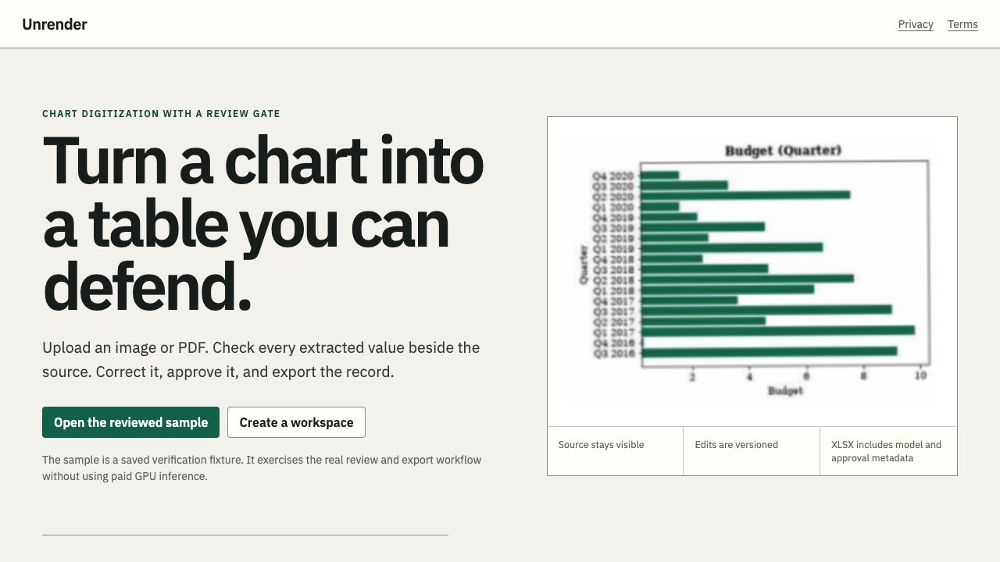
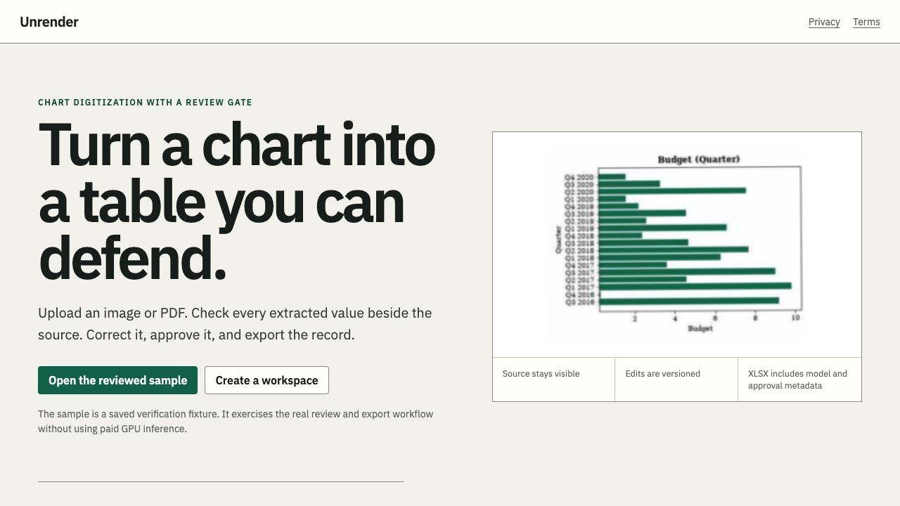
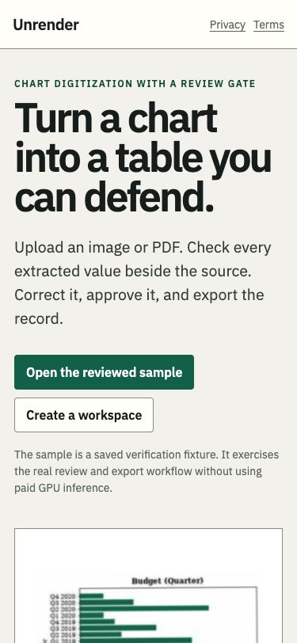
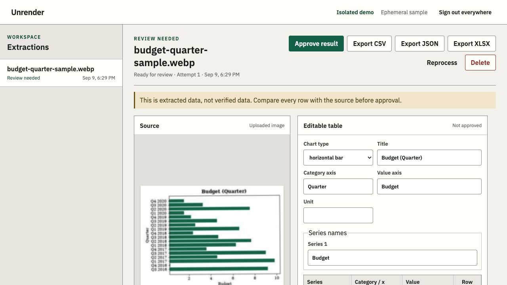
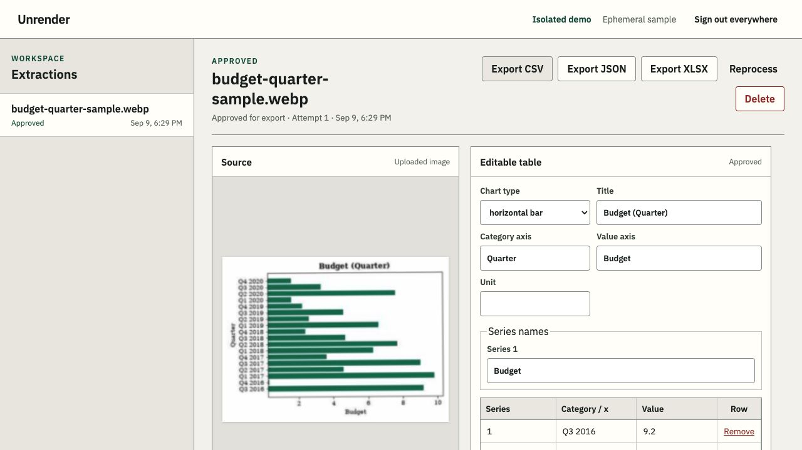
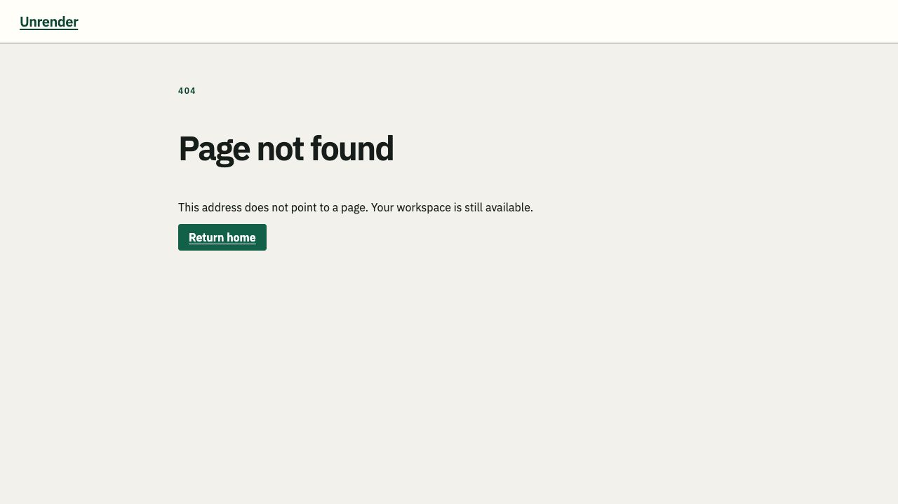
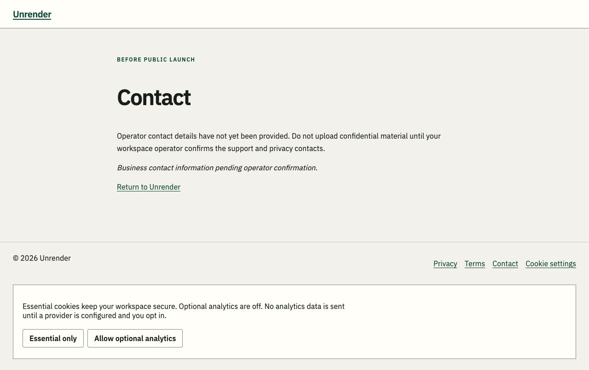

# Unrender production and UX pass — 2026-09-09

## Outcome and release boundary

Implemented a public-document shell, recovery pages, public-only search metadata,
icons, consent controls, contact scaffolding, mobile target fixes, and duplicate
submission protection. This is **not public-launch approval**. Legal operator and
contacts, analytics selection, deployed infrastructure verification, and the
existing real-inference/model release gates remain owner responsibilities.

Stack: FastAPI/Python; vanilla browser JavaScript; custom editorial CSS with local
IBM Plex fonts. SQLite plus private local files (not Supabase/Firebase). Intended
hosting is a persistent single-host/container deployment; Compose is development
replay configuration, not production configuration. Modal is the optional inference
provider. Stripe remains test-only. No cloud settings, credentials, or remotes were changed.

## Phase 1 — security, first

Reviewed `unrender/product/web.py`, `config.py`, `service.py`, `database.py`,
`storage.py`, frontend sinks, `.env.example`, and transport/security tests before
making UX changes. No confirmed exposed production credential or disabled auth
gate was found in the tracked-code scan. This is a source/worktree audit, not a
forensic review of deleted Git history or a live cloud penetration test.

| Item | Status / evidence |
|---|---|
| Exposed keys | ✅ Tracked-file signature scan for OpenAI, GitHub, AWS, Stripe live keys and PEM private keys produced no matches. Generic secret references reviewed without printing values. No key relocation needed. |
| Every endpoint auth + validation | ✅ Inventory below. Deliberately public bootstrap/doc/health routes do not require an existing session; webhook uses provider signature auth. |
| RLS/security rules | ➖ SQLite has no network anonymous role or native RLS. Browser access goes through authenticated service methods with `user_id` predicates; tenant-isolation regression tests retained. |
| Hardcoded true / bypass flags | ✅ No `if (true)`, `if True:`, disabled signature checks, broad CORS, or `verify=False` matches in product runtime. Development replay/registration flags remain explicitly prohibited by production validation. |
| Public storage buckets | ➖ No bucket in the application deployment. `Storage` uses 0700 directories/0600 files, root containment, generated IDs, authenticated source routes; uploads are not mounted as static files. ⚠️ Operator must verify any external backup/Modal bucket IAM in its actual account. |

Credential names and locations (no secret values): `STRIPE_SECRET_KEY` and
`STRIPE_WEBHOOK_SECRET` are server environment inputs in `config.py:347–348`;
`STRIPE_PRICE_ID` is a non-secret server-side price identifier. `OPENAI_API_KEY`,
`ANTHROPIC_API_KEY`, `GOOGLE_API_KEY`, `WANDB_API_KEY`, `HF_TOKEN` are empty research
environment placeholders in `.env.example`, not browser config. Session, CSRF,
and integration-key secrets are generated at runtime; full API keys are displayed
once, not embedded into static assets. No rotation was needed based on this scan.

### Complete transport inventory

Source: route decorators in `unrender/product/web.py`. All requests pass Host,
body-size, origin (on mutation), IP rate, and security-header middleware except
liveness intentionally bypasses the database-backed rate limiter. **S** = valid
session; **C** = session + CSRF; **B** = bearer API key. All three add principal
rate limits. Service ownership uses the authenticated identity, never a supplied
tenant ID. Typed route/body parsing, strict extra-field rejection, and service
validation are complementary rather than auth substitutes.

| Method and route | Protection and validation |
|---|---|
| GET `/` | Public fixed HTML shell, no account data. |
| GET `/privacy` | Public fixed legal draft. |
| GET `/terms` | Public fixed legal draft. |
| GET `/contact` | Public fixed contact scaffold; no submitted data. |
| GET `/robots.txt` | Public static rules from validated deployment origin. |
| GET `/sitemap.xml` | Public homepage-only allowlist, XML escaped; never tenant URLs or unapproved legal/contact drafts. |
| GET/HEAD `/static/{path}` | Public packaged assets only; StaticFiles path containment. |
| GET `/api/public-config` | Public two boolean capability flags; no secrets/account data. |
| GET `/health/live` | Public minimal liveness status, no request payload. |
| GET `/health/ready` | Public coarse ready/backend/worker status, no tenant data. Limit to internal ingress where desired. |
| POST `/api/auth/register` | Public bootstrap; strict credential body, email normalization/password KDF, rate/concurrency limits; production registration disabled. |
| POST `/api/auth/login` | Public bootstrap; strict credentials, password verification, rate/concurrency limits, session generation. |
| POST `/api/auth/demo` | Public isolated ephemeral replay-only sample; no arbitrary upload/paid inference; disabled in production. |
| POST `/api/auth/logout` | C; invalidates sessions; no arbitrary tenant payload. |
| GET `/api/me` | S; account fields shaped by service. |
| POST `/api/uploads` | C; customer-only, content/type/size/page quotas, private storage. |
| POST `/api/uploads/demo` | C; fixed saved sample, no arbitrary path. |
| GET `/api/uploads/{upload_id}/pages/{page_index}` | S; owned unexpired upload, typed bounded page index, generated raster. |
| POST `/api/jobs` | C; strict JobCreate/Crop, required validated idempotency key, owned upload, page/crop/quota/credit validation. |
| GET `/api/jobs` | S; own jobs; cursor/limit validation. |
| GET `/api/jobs/{job_id}` | S; owned job lookup. |
| GET `/api/jobs/{job_id}/source` | S; owned job, contained file, image response. |
| GET `/api/jobs/{job_id}/audit` | S; owned job, cursor/limit validation. |
| GET `/api/jobs/{job_id}/versions` | S; owned job, typed before cursor. |
| GET `/api/jobs/{job_id}/versions/{version}` | S; owned job/version, typed version. |
| PATCH `/api/jobs/{job_id}/result` | C; strict envelope, owned job, result schema and size validation. |
| POST `/api/jobs/{job_id}/approve` | C; owned job and eligible status. |
| POST `/api/jobs/{job_id}/cancel` | C; owned job and eligible state. |
| POST `/api/jobs/{job_id}/reprocess` | C; owned job, state/credits/quotas. |
| GET `/api/jobs/{job_id}/export/{output_format}` | S; owned job and format allowlist; attachment response. GET also appends an operational export audit event, not user-controlled business data. |
| DELETE `/api/jobs/{job_id}` | C; owned job; durable source-deletion outbox. |
| POST `/api/keys` | C; strict bounded name and key quotas; one-time secret. |
| GET `/api/keys` | S; own key metadata only, cursor/limit validation. |
| DELETE `/api/keys` | C; own keys only. |
| DELETE `/api/keys/{key_id}` | C; own key lookup. |
| POST `/api/billing/checkout` | C; customer-only, server-selected test price/credits, Stripe destination allowlist. |
| POST `/api/billing/webhook` | Stripe signature; bounded body, configured secret, event/type/reference/credit validation, deduplication; live-mode rejected. Cookie/CSRF intentionally not used for provider callback. |
| POST `/api/v1/extractions` | B; upload content/page/size validation, idempotency/credits/quotas. |
| GET `/api/v1/extractions/{job_id}` | B; owned job lookup. |

No additional serverless, WebSocket, or OpenAPI routes: docs/openapi/redoc are disabled.
Database tables have no anonymous direct API: users, sessions, uploads, jobs,
result_versions, audit_events, audit_rollups, credit_ledger, api_keys,
billing_events, provider_attempts, rate_limits, pending_deletions, api_idempotency,
storage_reservations, startup_state, schema_meta. Application service owns SQL;
administrative worker/schema operations are not browser endpoints.

Changed in phase 1: no boundary changes necessary; existing protections retained.
Deliberately skipped: cloud IAM mutation, credential rotation without exposure,
enabling production replay or live billing.

## Phase 2 — production web documents

Files: `unrender/product/public_site.py`, `web.py`, `static/contact.html`,
`static/site.js`, `static/site.webmanifest`, `static/icons/*`, `static/privacy.html`,
`static/terms.html`, `scripts/build_web_assets.py`, `pyproject.toml`.

| Item | Status |
|---|---|
| Custom 404 and 500 | ✅ Fixed-brand recovery HTML; real status codes; 500 exception details suppressed; API errors remain JSON including outer middleware failures. |
| Above-fold CTA | ✅ Existing saved-sample/sign-in actions retained; confirmed at desktop and 375px. Private key landing is the workspace upload action. |
| Per-page title + description | ✅ Home, privacy, terms, contact and error pages; fixed allowlist, no private titles in social tags. |
| OG/Twitter tags + fallback | ✅ Per-document title/description/URL, existing chart fixture image fallback. Brand-specific campaign artwork can replace the fixture later. ➖ Error pages intentionally noindex with no social-promotion tags: transient failures are not shareable landing pages. They retain a favicon and recovery link. |
| Favicon set/manifest | ✅ ICO, 16/32 PNG, Apple180, 192/512 manifest icons. Derived from existing public chart fixture, not customer assets; included in wheel package data. |
| robots + generated sitemap | ✅ Runtime-generated from validated base URL; homepage only, no private resources or draft documents. Privacy/terms/contact carry both noindex meta and X-Robots-Tag. Robots is not treated as access control. |
| Every image alt | ✅ Existing source/preview/hero alt labels retained; no unlabelled image introduced. |
| Analytics | ⚠️ Consent state/UI implemented; collection remains disabled pending provider, measurement ID and disclosure. No fake analytics events or external script loaded. |
| Privacy/Terms/cookies | ⚠️ Existing factual launch drafts preserved and owner TODOs added; functional essential/optional choice and withdrawal UI. Counsel/operator details required before launch. |
| Thank-you after forms | ➖ No lead/contact submission endpoint. Account creation now ends in the workspace with an explicit success/next-step message; editing keeps source/table context with saved confirmation. A separate generic thank-you redirect would interrupt that task. |
| Real mailto/tel/address | ⚠️ `/contact` scaffold with exact TODOs; nothing invented, no dead mailto/tel links. |

Deliberately skipped: third-party analytics network collection and fabricated business/legal details.

## Phase 3 — states and dead ends

Files: `static/app.js`, `static/app.css`, `public_site.py`, tests.

| Item | Status |
|---|---|
| Loading on async actions/transitions | ✅ Login/register/save forms now expose busy state and suppress duplicate submissions; generated job-action buttons disable while pending. Existing upload, queue, export, key creation, checkout, polling and history loading states retained. Native public-page navigation uses browser loading. ⚠️ Full assistive-technology and slow-network audit of every secondary action still recommended. |
| Inline validation/errors | ✅ Native email/password constraints plus server validation and auth/upload alerts; result validation errors remain live notifications. |
| Success/error for submissions | ✅ Added sign-in/workspace-created next step; existing save/approve/queue/revoke/delete/checkout errors retained. |
| Broken buttons | ✅ Core saved-sample and approval exercised; new consent/settings/recovery controls functional; existing regression suite covers remaining client handlers. |
| Internal/external/footer links | ✅ Public and footer routes plus icon links checked in tests. Product UI contains no external marketing hyperlinks; checkout target remains explicitly validated, live provider call not exercised. |
| Clickable logo | ✅ Existing workspace home-button behavior and document home links retained. |
| Placeholder/unused nav | ✅ No unused nav added. Required unknown owner content is explicitly flagged, not disguised as real contact information. |
| Dynamic copyright | ✅ Server-rendered current year in shared public footer. |

Deliberately skipped: redirecting successful review/save actions away from the chart and changing the carefully fenced cross-tab auth protocol.

## Phase 4 — mobile and performance

Files: `static/app.css`, `static/index.html`, `static/demo/budget-quarter-small.webp`, asset builder.

| Item | Status |
|---|---|
| Horizontal overflow | ✅ No visible page overflow in 375px home screenshot; header wraps account actions, legal content wraps. Table/sidebar overflow remains scoped scrolling intentionally. ⚠️ Full mobile editing flow/zoom/device matrix is not certified. |
| Real breakpoints across pages | ✅ Existing 980/640px app rules plus mobile footer/legal/header rules. |
| Hamburger focus trap/close on nav | ➖ Only two public header links; kept directly visible at375px. No hidden mobile navigation to trap; native API-key dialog retained. |
| Sticky mobile CTA | ✅ Extraction submit footer sticky at mobile widths; primary full-width button stays in task context. Landing CTA already above fold; no duplicate floating CTA obscuring content. |
| Optimized images/srcset/lazy | ✅ Existing small WebP hero plus 240px derivative, truthful width descriptors, dimensions and async decode. Hero is above fold and should not lazy-load. Private review images load only when their associated task opens; not prefetched below fold. |
| 44px/readability | ✅ Mobile buttons, navigation links, text controls, table inputs and wordmark targets ≥44px; form inputs16px. Visible mobile home inspected. |

Deliberately skipped: resizing actual source chart data or recompressing uploaded evidence; that could harm review accuracy.

## Phase 5 — UX constraints applied

| Principle | Concrete application / deliberate preservation |
|---|---|
| Hick / Occam / Tesler | ✅ Two hero actions retained; no new marketing nav maze. Secondary policy/contact/consent controls grouped in footer; no unnecessary hamburger. Advanced history remains disclosure-based. |
| Fitts / target distance | ✅ Mobile44px targets, full-width sticky extraction action near task details. |
| Jakob / Similarity / Connectedness | ✅ Same existing CSS tokens/buttons reused for legal/error/consent; familiar privacy/terms footer and native form constraints. |
| Proximity / Prägnanz | ✅ Contact/consent actions grouped, one bounded notice, responsive wrapping instead of clipping. |
| Miller | ✅ Two header links, four footer actions; existing editor pagination retained rather than dumping unbounded values into the DOM. |
| Doherty | ✅ Immediate busy feedback and duplicate suppression added without pretending durable inference is instantaneous; existing queued/running status remains truthful. |
| Von Restorff | ✅ Green primary sample/approve/extract control preserved; secondary consent choices equal weight. |
| Serial position | ✅ Primary workflow action first, destructive action remains last; footer contact/settings are discoverable at the end. |
| Peak-end / Zeigarnik | ✅ Account creation ends with success + upload next step; observed review → approved-for-export progression remains visible; saved corrections stay in context. |
| Postel | ✅ Trim email before sending; password untouched; strict server schemas/normalization remain authoritative. |
| Pareto | ✅ Prioritized entry, saved sample, review/approval, upload action and recovery, not low-value decorative effects. |

## Phase 6 — optional visual polish

➖ Proposed direction: preserve the existing warm-paper, dark-green editorial
workspace, with compact typography and a clear source/table split. No redesign
executed pending owner approval. Magic UI is React-specific and does not fit this
vanilla stack without migration. Threlte/R3F/3D would not improve chart review and
were not installed. Vectary/Jitter exports could later fit a marketing-only hero,
but no asset or dependency is needed for the current workflow.

## Current-run evidence and limitations

Goal: open saved sample → inspect source/table → approve for export; verify public
entry/mobile/recovery. These are local replay fixtures, not evidence of model quality.

1. [Desktop before](ux-evidence/01-home-before.png): healthy primary hierarchy; no footer/contact/consent shell.
2. [Desktop after](ux-evidence/02-home-after.png): established aesthetic preserved; hero still readable.
3. [Mobile375px](ux-evidence/03-mobile-after.png): clear CTA, wrapped copy, visible legal links; healthy entry.
4. [Sample review](ux-evidence/04-sample-review.png): source alongside table, explicit review warning; healthy bounded core flow.
5. [Approved result](ux-evidence/05-sample-approved.png): persistent approved state and export actions; clear task completion.
6. [404 recovery](ux-evidence/06-not-found.png): branded recovery with working home destination.
7. [Contact and consent](ux-evidence/07-contact-consent.png): honest owner-input boundary; essential-only dismissal and reopening settings verified with focus restoration.

Screenshots captured using the Codex in-app browser and saved in this audit run.
No full WCAG certification, live Stripe charge, paid Modal call, production TLS/IAM
inspection, or arbitrary user upload was performed. Test results recorded below.

## Owner TODOs and follow-ups

- `static/contact.html`: provide monitored support email (`mailto`), telephone (`tel`), legal operator and physical business address.
- `static/privacy.html`: legal operator/jurisdiction/effective date/privacy contact; reviewed cookie/analytics disclosure.
- `static/terms.html`: counsel-approved terms/operator/jurisdiction/effective date.
- `public_site.py` and `static/site.js`: approved analytics provider/measurement ID/privacy disclosure; currently no analytics collection.
- Set the real `UNRENDER_BASE_URL` for canonical/social/sitemap URLs; verify deployed TLS/Host/proxy/backup permissions.
- Keep existing production model/quality/operational release gates. A polished sample is not proof that arbitrary chart extraction is accurate.
- Remove draft noindex metadata/headers and add approved documents to `INDEXABLE_PATHS` only after legal/contact content is complete.
- Review fixture-derived favicon/social art with the product owner before a brand launch.

## Verification

- Existing product tests: 93 passed before final UI adjustments.
- New public-page regressions: metadata, footer links, assets, private sitemap exclusion, API auth/error contracts and sanitized HTML500 passed.
- Final full suite: **169 passed, 1 skipped** (committed Modal split artifacts absent), 1 upstream Starlette/httpx deprecation warning, 52.70s.
- Ruff: passed for product modules, new tests and asset builder. Mypy: no issues in14 product modules. Both browser JavaScript files passed `node --check`.
- A discovered outer-handler regression was repaired and the entire suite rerun rather than waived.
- Final review follow-up: legal/contact drafts excluded from sitemap and marked noindex in HTTP headers and static HTML; error-page favicon added. Both affected public-site tests and Ruff passed again after these changes.
