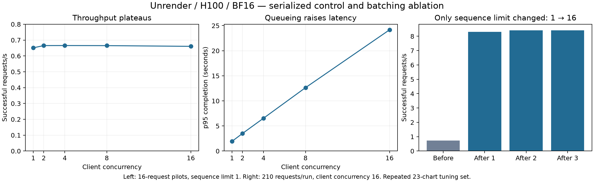

# Unrender serving case study — 16 September 2026

An isolated H100 experiment verified the frozen Unrender checkpoint on vLLM 0.11.0,
measured a queueing limitation, and tested one scheduler change. Increasing
`max_num_seqs` from 1 to 16 raised throughput from **0.73 to 8.31–8.42 successful
requests/s**, and reduced p95 completion latency from **24.42 to 2.51–2.53 seconds**.
The tuning set showed a **1.42–1.63 percentage-point numeric accuracy loss**, so
speed alone does not justify promotion. This is integration and operation of an
existing engine, not custom runtime or CUDA authorship.

## Reproducibility and comparison boundary

- Runtime: vLLM **0.11.0**, Transformers **4.57.6**, BF16, H100 80GB, Python 3.12.
  Full package versions, driver information and GPU UUIDs are in the raw evidence.
- Frozen production model digest:
  `3954f3395a9db64fcbd3b9dc94508ab0cf9af2f5f2156643504881ee712e8c7e`.
  The final job verified every snapshot byte with the production digest algorithm.
  Both runtimes used this **existing merged production checkpoint**, not a new
  merge or substitute base model. Vision/language LoRA loading was not claimed:
  the adapter has vision targets, beyond this pinned runtime's documented
  language-backbone LoRA support. Adapter-versus-merge equivalence was not tested.
- Production provider implementation pinned to
  `606408af6c0f59959867458cf026ebe0e4f9ef65`; its source hash is recorded in
  `experiments/serving/compatibility/discovery.json`.
- Same physical H100 for the Transformers/vLLM pilot and scheduler performance
  comparison, one engine at a time. The reserved final quality job has its own
  H100, separate from load-test timing. No production requests were used.
- Same saved image processor, image bytes, extraction prompt, greedy decoding,
  seed 0, 4,096 output-token cap, 8,192 context and scheduler token limits.
  All 23 pilot prompt-token counts matched. This is evidence of compatibility,
  not proof that intermediate pixel tensors or floating-point kernels match.
- Prefix caching was disabled throughout. Only the sequence limit changed in the
  batching ablation; weights, precision and scheduler token budget stayed fixed.
  The single-sequence baseline is an **intentional serialized control**, not the
  default vLLM configuration or a discovered production misconfiguration.
- Validation workload: 23 small synthetic charts (3–16 points), deterministically
  selected across chart families from validation, disjoint from common300.
  Performance runs repeat these into 210 requests with original IDs retained.
  They are not 210 independent charts. There is one before run and three after
  runs; the 16/23/32-request pilot p95 values are descriptive, not stable tail
  estimates. Longer steady-state tests remain useful.

Client completion latency covers the provider request, transport, engine queue,
processing, generation and application validation. It excludes product upload,
API/worker queues and file-read setup. TTFT starts at dispatch and ends on an
actual streamed token event: token IDs for the Transformers reference, nonempty
content deltas for vLLM. It is not inferred from final-response timing. Server
queue histograms, running/waiting gauges and GPU readings were sampled roughly
once per second. Samples can miss brief peaks.

## 1. Comparable baseline

The streaming Transformers reference matched **23/23 raw outputs exactly** against
the current existing provider. Transformers versus vLLM matched 8/23 raw outputs;
numeric results must therefore be measured, not assumed equivalent.

| Warm pilot, concurrency 1 | Transformers | vLLM, sequence limit 1 |
|---|---:|---:|
| Requests / failures | 23 / 0 | 23 / 0 |
| Successful requests/s | 0.187 | 0.700 |
| Output tokens/s | 46.43 | 173.42 |
| TTFT p50 / p95, seconds | 0.068 / 0.091 | 0.086 / 0.106 |
| Completion p50 / p95, seconds | 5.608 / 7.417 | 1.511 / 1.946 |
| Output tokens p50 / p95 | 260 / 346 | 260 / 343 |
| JSON / strict schema success | 23 / 23 | 23 / 23 |
| Numeric cell@5_exact | 63.64% | 64.94% |

Cold server startup was **20.18 seconds** for Transformers and **128.25 seconds**
for the first vLLM launch. A later vLLM restart took 54.18 seconds with compilation
artifacts available. Startup is excluded from warm latency. The original provider's
first request, including load, took 21.94 seconds; its subsequent 22 requests had
p50 6.04 and p95 7.98 seconds. The reference server records preprocessing and
inference separately; vLLM client TTFT combines preprocessing, prefill and queue
wait, so it is not a standalone preprocessing measurement.

This 23-chart pilot establishes runtime comparability on that workload. It does
**not** establish full common300 Transformers-versus-vLLM quality parity.

## 2. Saturation and queueing evidence

| Client concurrency | Successful requests/s | p95 completion, seconds | Failures |
|---:|---:|---:|---:|
| 1 | 0.651 | 1.931 | 0 |
| 2 | 0.665 | 3.505 | 0 |
| 4 | 0.666 | 6.542 | 0 |
| 8 | 0.665 | 12.639 | 0 |
| 16 | 0.661 | 24.169 | 0 |

These are 16-request pilots with the same single-sequence control. Arrival-rate
pilots of 32 requests at approximately 0.499, 0.666 and 0.832 requests/s produced
0.504, 0.657 and 0.727 successful requests/s, with p95 completion of 1.92, 2.37 and
6.62 seconds and no failures. Finite workload composition and final drain affect
these rates; they do not locate long-run saturation precisely.

In the 210-request control, metrics showed **one running and up to 15 waiting
requests**. Observed queue-time histogram deltas totaled 4,148.87 seconds across
209 completions (the last completion falls beyond the final scrape). Throughput
stayed flat as client concurrency rose, while waiting time rose. That identifies
the configured sequence limit as the immediate bottleneck.

## 3. Structured generation

| Same 23 charts, concurrency 1 | Unconstrained | ChartData JSON schema |
|---|---:|---:|
| JSON parse success | 23/23 | 23/23 |
| Strict schema success | 23/23 | 23/23 |
| Numeric cell@5_exact | 64.94% | 64.61% |
| Warm p95 completion | 1.946 s | 1.956 s |
| Warm successful requests/s | 0.700 | 0.701 |

The first constrained request had **3.793-second TTFT** and **4.938-second
completion**, versus warm constrained p95 TTFT 0.063 seconds. This is observed
first-schema overhead, not a separately isolated compiler-duration measurement.
No validity gain was observable because both pilots already produced valid JSON.
Numeric accuracy fell 0.325 percentage points; grammar constraints do not ensure
correct values. Application semantic validation remains necessary.

## 4. One intervention: allow 16 running sequences

| Same 210-request workload, client concurrency 16 | Before | After 1 | After 2 | After 3 |
|---|---:|---:|---:|---:|
| Successful requests/s | 0.727 | 8.308 | 8.407 | 8.417 |
| Output tokens/s | 180.3 | 2059.9 | 2085.5 | 2087.4 |
| p95 TTFT, seconds | 22.931 | 0.367 | 0.339 | 0.334 |
| p95 completion, seconds | 24.420 | 2.528 | 2.507 | 2.507 |
| Failures | 0 | 0 | 0 | 0 |
| Strict schema success | 210/210 | 210/210 | 210/210 | 210/210 |
| Numeric cell@5_exact | 64.81% | 63.18% | 63.39% | 63.18% |

Afterward metrics showed up to **16 running and zero sampled waiting requests**.
Observed queue-time deltas were approximately 0.0012 seconds per run. Peak sampled
GPU memory rose from **53,677 to 54,695 MiB**, leaving at least **26,385 MiB free**.
No preemptions were observed. Maximum cache occupancy was approximately **0.273%
versus 2.9%** of the runtime's allocated KV cache. Total GPU memory, allocated KV
capacity and occupied cache blocks are different measurements; this experiment
does not implement or change the cache manager.

The measured speedup is 11.4–11.6× against the intentionally serialized control.
It is not an 11× improvement over default vLLM or the deployed product.

## Reserved final quality decision

Final common300 comparison is being collected. The preregistered scheduler gate
requires all 300 charts in both configurations, no infrastructure failures,
no strict-validity regression, and at most **1 absolute percentage point** loss
in cell@5_exact. No promotion decision may be inferred from the tuning speedup.
The unchanged common300 scorer is retained; an additional failure-inclusive
summary counts operational failures as misses instead of hiding them.

## 5. Failure and cancellation evidence

- Cancelled 32 real GPU requests with **16 running and 16 queued**. All clients
  reported cancellation; running and waiting gauges returned to zero by the
  first post-cancel sample at **1.006 seconds**, remaining zero for ten samples.
  Client cancellation took 0.006 seconds. This demonstrates request-resource
  release, not return of the runtime's reserved GPU allocation to the OS.
- A 50 ms deadline produced `provider_timeout`; the transport does not retry.
- A malformed image produced HTTP 400. An invalid schema produced **HTTP 200
  with an SSE error carrying code 400**; HTTP status alone is insufficient.
- A separate real worker subprocess was killed with SIGKILL against an isolated
  database and a blocked fake provider. Recovery took **10.135 seconds** with a
  10-second lease; one inference attempt was recorded, no redispatch occurred,
  and a stale terminal write was rejected. Queued cancellation caused zero
  provider attempts. This is worker/database evidence, not a GPU worker-crash
  experiment. See `experiments/serving/worker-crash.json`.

## Evidence, reproduction and limits

Run `python -m pip install -e '.[serving]'` locally and install the Modal CLI.
With authenticated access to the private model/data volumes and paid-compute
approval, `modal run scripts/modal_serving_case.py` runs the bounded case and
`modal run scripts/modal_serving_final.py` runs the reserved comparison.
These commands incur GPU charges. They never deploy or replace the product.
The runners pin the production provider source commit and record checkpoint hashes,
launch settings, workload hashes, every response and every failure.

Committed evidence: [performance summary](../experiments/serving/h100-20260916/case-summary.json),
[metrics summary](../experiments/serving/h100-20260916/metrics-summary.json),
[raw responses, metrics and logs](../experiments/serving/h100-20260916/performance-raw.tar.gz),
and [per-file SHA-256 index](../experiments/serving/h100-20260916/performance-files-sha256.json).

Primary raw evidence: Modal volume `unrender-serving-results`, directory
`case-20260916-171735`; final directory `final-20260916-173625`.
Run dashboards: [performance experiment](https://modal.com/apps/royluo05/main/ap-ZgGlSLAIcAytipZSLzNM2y)
and [final quality experiment](https://modal.com/apps/royluo05/main/ap-I4X2GI7eGQI7mWTuBSn2bx).
The performance app completed and stopped at 17:40:33 UTC.

The vLLM image is `vllm/vllm-openai:v0.11.0`, resolved linux/amd64 digest
`sha256:d8d39b59e909d2378ac4feeb191f7e7b6f1342477dc66b7c47cec89e9985ad8a`.
Python dependencies are pinned in the runner; the actual environment freeze is
saved. Historical startup failures included image/bootstrap and missing mounted
files; these were fixed before the successful runs, not counted as model successes.
Strict schema rates in the offline report are recomputed with strict validation;
original raw measurements and original summaries remain unchanged.

Local verification: **186 passed, 1 skipped** in the full suite, plus **17 passing
serving tests** after the reporting changes; targeted lint passed. Production
source has advanced beyond the experimental branch. No old product code was
deployed over the current application, and no production provider was switched.
Quantization, speculative decoding, prefix-cache ablations, a sustained post-change
arrival sweep, end-to-end OpenTelemetry traces and GPU profiler traces were not
completed in this one-hour pilot. The measured queueing evidence did not require
claiming a GPU-kernel optimization.
