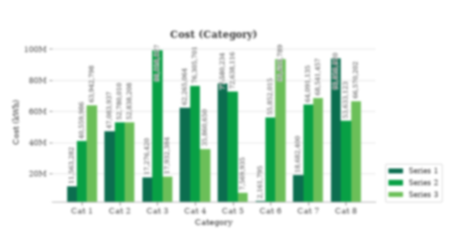

# Native layout repair and actual image-input audit

This checkpoint repairs the four saved layout failures and inspects the pinned
production image processor on CPU. It does **not** establish new model accuracy,
independent chart recoverability, GPU parity or readiness to train.

## Results and remaining defect

| Check | Observed result | Limit |
|---|---|---|
| Four saved native layout failures | All categories/printed values retained; no measured text collision, clipped text or legend/plot overlap | Rectangle checks do not test all mark occlusion or leader association |
| 72 development charts, 24/profile, seed 47000 | All native layouts clear; all target hashes unchanged from the preceding checkpoint | The same development examples informed the repair |
| 180 further native renders, 60/profile, seeds 91000–91059 | All measured layouts clear | Same renderer and sampler; no independent eligibility review |
| 72 charts at full and 512-token image budgets | All 144 saved rasters reconstructed exactly from encoded pixels and matched captured resize tensors | CPU image processing only; no tokenizer, model or GPU execution |
| Effect of 512-token budget | 19/72 charts use fewer image tokens; full range 64–1200, capped range 64–512 | Token reduction is not an accuracy measurement |
| Two blurred examples | Full/512 pixel tensors and rasters are identical; damage is already visible at the first blur stage | Two diagnostic examples, not an estimated population failure rate |

Native rendering moves legends outside the plot, rotates crowded categories,
places values with leaders and grows the canvas within a finite budget. It never
removes a difficult label or changes the target to clear a collision. Unresolved
problems are recorded. Rotation augmentation now expands its canvas and preserves
the corner background color. The normal and geometry renderers share style, DPI
and layout; equal encoded tick anchors preserve exact retained calibration values
without snapping nearby coordinates or restoring rejected outliers.

The layout report and geometric font estimate are carried in new
`synthetic-generation-v2` / `synthetic-split-v2` bundles. The target contract stays
`chart-visible-v1`. Frozen historical evidence is unchanged.

## Read the counterexamples

The grouped chart below has readable values in its clean native render, but
Gaussian blur with radius **1.323 pixels** already makes small digits difficult
to distinguish. Subsequent down/up-scaling (factor 0.848) and brightness/contrast
changes produce the exact generated PNG. Its full and 512-budget processed input
is the same 576×288 raster, using 162 image tokens.

For [the small pie](augmentation/hard-0000013/00-native.png), blur radius
**1.230 pixels**, JPEG quality 59 and noise sigma 11.487 produce the exact final
image. The full and capped inputs are identical at 384×256 / 96 image tokens.
Its printed values also become difficult to read. These are one agent's visual
observations; neither example has independent human annotation approval.

Each replay retains every applied stage, parameter draws, image hashes and exact
final-image equality. The native geometric font estimate misses this damage: it
does not represent blur, contrast, glyph height or the precision a person can
recover. Five of 72 processor outputs have a minimum estimate below 8 pixels at
both budgets, but **8 pixels is not a validated eligibility threshold**.

The four original repaired layouts are retained under [native/](native/), with
their full and capped processor outputs under [processor/varied/](processor/varied/).
All categories and target tables remain in the bundles, including these failures.

## Provenance and reproduction

[Verification](verification.json) retains all three generation/split receipts,
source/library/font identities, target comparisons and artifact hashes. Compressed
manifests retain all 72 full specifications. `native-180.json.gz` retains the
broader native check. `processor-report.json.gz` retains all 144 input identities,
grids, token counts and package versions; 12 exact processor PNGs are included.
The other processor rasters and full generated/split bundles were local temporary
artifacts. There are 26 retained PNGs in total; all are owned synthetic charts.

The configuration was recovered read-only from the release path recorded in
`verification.json`, with SHA-256
`93585062a80db5e8ca038efc7726a3e6411d9db948472d81d63c6303993be8c5`.
The full release weights were not downloaded or independently rehashed. The class
is `Qwen2VLImageProcessorFast`, as specified by the actual saved configuration
despite its `Qwen3VLProcessor` wrapper name.

Direct CPU dependencies match the pinned production versions: torch 2.9.1,
torchvision 0.24.1, transformers 4.57.6 and Pillow 12.3.0. This local processor
environment uses Python 3.14.2 on macOS ARM; it differs from the production Python,
OS and device. The generator used the separate locked Python 3.11 environment.
No model weights were loaded, paid inference/training dispatched or deployment
changed.

**543 tests passed, zero skipped**, with four existing dependency/local-Modal
warnings. Lint and product type checks passed. A clean staged Git source archive
contained all 26 PNGs and passed every recorded artifact, generation-source,
auditor-source and processor-config hash check. It also reproduced all 900
historical Common300 predictions with unchanged scores and paired intervals.
Those historical scores remain subject to the previously documented target defects.

Follow [the current workflow](../../docs/SYNTHETIC_DATA.md) to generate fresh
24-chart bundles with seed 47000 for each easy, `--hard`, and `--v2` profile;
split each with validation/test sizes 4. Run `analysis.audit_image_budget` on all
three using the retained config in a local directory. For the exact augmentation
traces use `analysis.replay_augmentation` with varied ID `0000020` and hard ID
`0000013`. Exact replay requires the recorded source/environment; it rejects drift.
Cross-platform PNG equality is not promised.

## Required before training or new quality claims

- Review visible numeric precision, glyph/mark contrast and leader association
  after augmentation and after the real processor, not only in native renders.
- Freeze an independently reviewed supported slice and a separately declared
  stress/abstention slice. Keep every scheduled chart in its declared denominator.
- Bound destructive augmentation using reviewed evidence; a minimum font-size
  heuristic alone is insufficient. Do not silently remove failures or train an
  exact numeric target that the raster cannot support.
- Evaluate the actual model at both budgets on the same frozen charts. Only then
  decide whether the useful next intervention is preprocessing, data or training.

Passing native layout checks closes a specific generator defect. Augmentation
recoverability and the broader [readiness plan](../../docs/REVIEW_READINESS_PLAN.md)
remain open.
