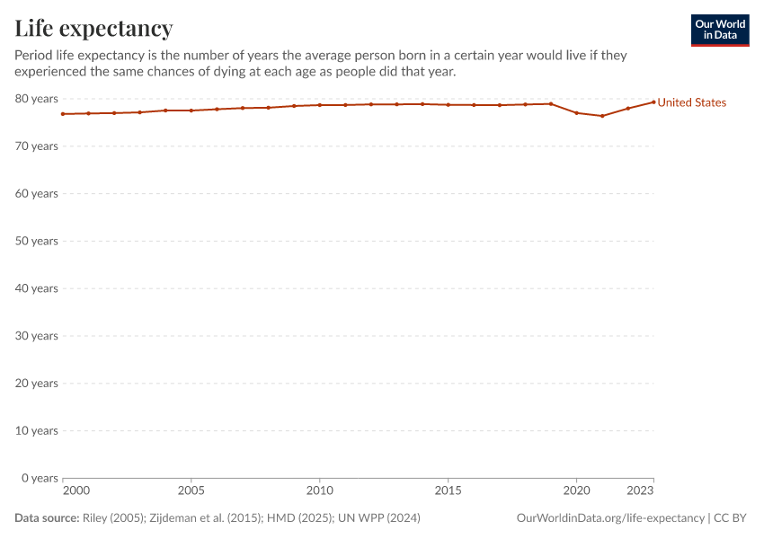

# Real_v0 visual audit: reject the historical comparison

All eight recovered OWID images disagree with the stored chart titles and series
names. The fetcher also invents x/y axis labels absent from the images. The base,
earlier LoRA and Gemini saved runs each use these defective targets for all eight
rows. Their strict semantic scores cannot establish relative model quality.

This changes the earlier status from **awaiting visual review** to **confirmed
annotation defects; comparison rejected**. It does not establish that any model
is accurate, inaccurate, better or worse on a valid real-world benchmark.

## Direct image evidence

| Recovered image | Title visible in image | Stored title |
|---|---|---|
| [Life expectancy](images/owid_life_exp.png) | Life expectancy | Life Expectancy, United States |
| [Population](images/owid_population.png) | Population, 2000 to 2023 | Population, United States |
| [GDP](images/owid_gdp_pc.png) | GDP per capita | GDP per Capita, United States |
| [CO₂ per capita](images/owid_co2_pc.png) | CO₂ emissions per capita | CO2 Emissions per Capita, US |
| [Internet](images/owid_internet.png) | Share of the population using the Internet | Internet Use, United States |
| [HDI](images/owid_hdi.png) | Human Development Index | Human Development Index, US |
| [Energy](images/owid_energy_pc.png) | Energy use per person | Energy Use per Capita, US |
| [Annual CO₂](images/owid_co2_total.png) | Annual CO₂ emissions | Annual CO2 Emissions, US |

Every visible line is named **United States**. Every stored series instead uses
the invented title in the table's right column. All images have year tick values
but no printed x-axis label; the targets invent `Year`. No image has a printed
y-axis label; the targets invent one. Units do appear in ticks/subtitles/notes:
years, percent, kWh, tonnes, millions/billions, and international dollars at 2021
prices. The audit records their visible text without silently choosing new unit
aliases or rescaling the old answers.

The complete [audit record](audit.json) binds all eight observations to PNG and
original-target hashes, records dimensions and source credits, and identifies the
three affected prediction artifacts by hash. The original
[dataset](../../data/real_v0/test.jsonl) is preserved unchanged.

## A second problem: relative tolerance can hide missing trends

On the original numeric targets, predicting **78 years for every year** passes
24/24 life-expectancy values at 5% relative tolerance. Predicting **0.9 for every
year** passes 24/24 HDI values. These are value-only sensitivity examples, not
model scores: metadata, point identities, units and complete-table correctness
are still required. They show why a high value-within-5% score alone cannot prove
recovery of the visible changes in a high-offset, narrow-range time series.

The replacement evaluation must report error relative to the displayed axis span
and simple constant/trend baselines alongside semantic precision/recall, exact
table outcomes and units. Numeric precision requirements must also respect the
input raster: the HDI plot's roughly 400-pixel height spans 0–1, so one vertical
pixel represents about 0.0025, while some source values differ by only 0.001.
Exact source values are useful references but not all their digits are visually
recoverable. Freeze tolerances on development data before scoring a final holdout.

## Evidence limits and replacement

The PNGs were downloaded from the existing `unrender-vol/data/real_v0/images`
paths on 2026-09-18, then inspected directly. They were not regenerated from
today's public URLs. The recovered Modal annotations match the committed local
annotations. Original inference logs contain no image hashes, so identity of
these current volume bytes with the historical inference inputs is **unproven**.
Original CSV downloads were not retained; this review does not independently
revalidate the numeric values or chart/data version match. It is one agent visual
review, not the required second independent annotation review for a final set.

Keep this set as a regression example of a flawed benchmark. Create a new
development set and separate final holdout with at least 300 independent charts,
source/table-disjoint groups, multiple renderers and supported chart families.
Preserve image and source-data bytes, transformations, actual visible metadata,
recoverability decisions and reviewer identities. Evaluate the current fair
LoRA, pinned base and any frontier controls on the same frozen inputs. The eight
historical charts evaluated an earlier LoRA and cannot decide whether new
training will help the current model.

## Guard against recurrence

The [real-chart workflow](../../data/real_v0/README.md) now requires a
`real-ground-truth-review-v1` receipt before building or evaluating externally
sourced rows. It binds the annotation, image and saved source data; records checks
of visible metadata, values, scale/units and recoverability; and identifies the
reviewer and time. The builder verifies source bytes and the loader rechecks
annotations and present images. Draft, absent or stale reviews fail before a
provider call. Historical scoring remains diagnostic and marks unverified rows;
paired bootstrap and comparison reports reject those rows.

The receipt detects missing review and changed inputs. It cannot certify an
honest, correct or independent review, authenticate external provenance omitted
from a row, or prove that a dataset was withheld during model development.

## Attribution

The eight PNG visualizations are by **Our World in Data**, reproduced unchanged
with embedded source credits under [CC BY 4.0](https://creativecommons.org/licenses/by/4.0/).
They are not licensed under this repository's Apache license. OWID describes its
visualization licensing and distinguishes underlying providers' terms on its
[data pages](https://ourworldindata.org/grapher/life-expectancy).
The audit is Unrender's assessment, not an endorsement by OWID or its providers.

Source pages: [life expectancy](https://ourworldindata.org/grapher/life-expectancy),
[population](https://ourworldindata.org/grapher/population),
[GDP](https://ourworldindata.org/grapher/gdp-per-capita-worldbank),
[CO₂ per capita](https://ourworldindata.org/grapher/co-emissions-per-capita),
[Internet use](https://ourworldindata.org/grapher/share-of-individuals-using-the-internet),
[HDI](https://ourworldindata.org/grapher/human-development-index),
[energy](https://ourworldindata.org/grapher/energy-use-per-capita), and
[annual CO₂](https://ourworldindata.org/grapher/annual-co2-emissions-per-country).
These live pages can change; they are attribution links, not immutable identities
of the recovered PNGs. Underlying provider credits are retained in each PNG and
listed per chart in the audit record.

## Verification

**476 tests passed, zero skipped**; evaluation lint and formatting passed. The
18 real-set/audit checks also passed from a clean Git source archive containing
all eight evidence PNGs. Common300 raw scores and paired comparisons remain
unchanged. See the [verification record](verification.json). No new GPU runs,
paid model API calls or deployment were performed.
