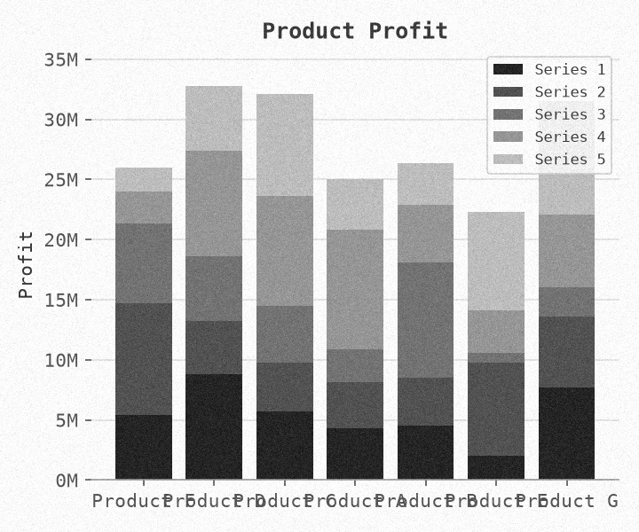

# Synthetic pipeline repair and remaining visual failures

Local CPU verification of `chart-visible-v1`, `synthetic-generation-v1` and
`synthetic-split-v1`. This is not an approved benchmark, new model evaluation,
training run, or production rollout.

The implementation fixes hidden single-series names, unit-only axes, cumulative
stack bounds and the generation-to-split path failure. New bundles record their
sources/environment and image/target identities; generation and splitting refuse
existing outputs. Evaluation and training verify receipts and resolve images from
their split directory. Cloud generation no longer targets historical dataset names
or deletes an old completion sentinel. The renderer isolates library defaults and
per-spec styles from caller settings, so worker startup mode does not inherit an
unrecorded custom style.

See [the workflow and limits](../../docs/SYNTHETIC_DATA.md) and
[regression tests](../../tests/test_generation_contract.py).

## What was exercised

Three 24-chart bundles (easy, hard, varied; seed 47000; augmentation enabled) were
generated and split locally. Each covers all seven supported chart families. All
three bundles passed verification and evaluation/training loading: 16 train,
4 validation and 4 test rows per profile. These are development smoke examples,
not independent holdouts. Matching index seeds across profiles also do not imply
source/table-disjoint evaluation.

[Verification](verification.json) retains recipes, source/environment hashes,
split hashes, counts and test results. The three compressed manifests preserve
all 72 complete specifications and target/image hashes. Six exact PNGs inspected
at native size are retained below. The other 66 images and full split bundles
were temporary local smoke artifacts and are not included in this receipt.
No image byte identity across different rendering environments is promised.

## Verification

**522 tests passed, zero skipped**; lint and product type checks passed. A clean
Git source archive passed the 108 focused checks and reproduced all 900
historical Common300 predictions with unchanged scores and paired intervals.
The six retained PNGs and three manifests match their recorded hashes, and all
generation source hashes match this checkpoint. All retained images are owned
synthetic renders.

## Inspection caught unresolved failures

- [Varied stacked chart, 0000006](examples/varied-0000006.png): cumulative
  endpoints now fit, but category labels collide and the legend covers a stack.
- [Varied grouped chart, 0000003](examples/varied-0000003.png): the required `GB`
  unit is visible without an axis name, but the legend covers final-group bars.
- [Varied labeled stack, 0000015](examples/varied-0000015.png): the lower-right
  legend obscures a printed segment value despite correct cumulative bounds.
- [Varied dense bar chart, 0000005](examples/varied-0000005.png): several printed
  values collide. The old large-magnitude heuristic misses this configuration.
- [Hard unit-only bar chart, 0000022](examples/hard-0000022.png): unit text is
  present, but blur and small text remain recoverability concerns.
- [Easy line chart, 0000011](examples/easy-0000011.png): the single-series name
  is null; the five printed values and category names are visible in this sample.

These are one agent's native-image observations, not independent annotation
approval or a legibility rate. The deployed processor was not run on this set.
Every row retains `visual_review: not_reviewed`; no bad example was quietly
excluded from the generated bundles.

Next work must address layout collisions, legend occlusion and augmentation,
then check the actual model-input raster and freeze eligibility/precision rules.
The repaired data plumbing and passing tests do not justify more training yet.
